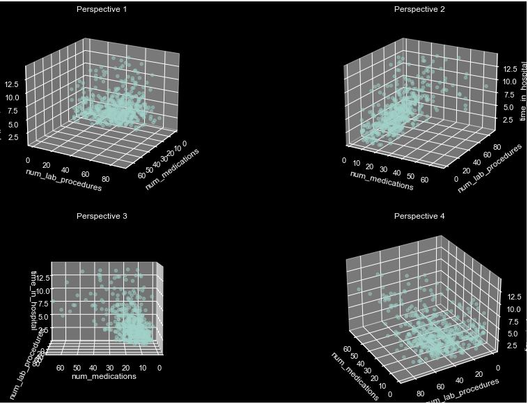

# Python for Data Analysis on Diabetes

## Project Team
- Oscar Pastural
- Richard Goudelin
- Capucine Boudin

## Dataset Definition
Analysis of clinical data from 130 US hospitals over ten years (1999-2008), focusing on diabetic patients.

- **Feature Type**: Multivariate
- **Instances**: 101766
- **Features**: 47

## Problem Definition
How can we predict a diabetic patient's readmission status?

## Sub-Problem Definition
How long does a patient stay for the first time in the hospital ?

## Notebook Outline
1. **Overview**
2. **Preprocessing**
   - a) Libraries Import
   - b) Data Import
   - c) Data Exploration
   - d) Data Cleaning
      - Missing Values
      - Multiple Encounters
      - Useless Columns
      - Missing Genders
      - Mapping the Data
      - Data Types
      - Re-Writing Data
      - Eliminating Zero Variance Data
      - Mapping the Diag Columns
      - Categorical Data
      - Encoding Data
      - Custom Variables
      - Feature Engineering - chi2
      - Data Balancing
      - End of Preprocessing
4. **Distribution Plots**
5. **Machine Learning Models**
   a) Evaluating Models: Linear Regression, RandomForest, DecisionTree Classifiers
   b) Feature Importances and Coefficients
   c) Grid Search: Finding the best hyperparameters
   d) Re-evaluating the models
6. **Regression Model Study**
   a) Evaluating Models for regression
   b) Improving the data with PCA
   c) Finding hyperparameters for the best model (Gradient Boosting)
7. **Conclusion**

## Conclusion and Reflections
We have studied this dataset from the perspective of Machine Learning Models and can conclude to good results with the information extracted.

The results obtained allow us to make forecasts leaning more towards preventive measures than precise predictions. This shift from a purely reactive to a more preventive approach in healthcare could significantly change how we manage chronic diseases like diabetes. It emphasizes the importance of early intervention and continuous, personalized care to more effectively manage the disease.

In conclusion, while our study has made considerable progress in predicting patient readmission, it also highlights the need for further research. This research should aim to uncover less visible variables affecting diabetes, improve measurement methods, and ultimately, guide us toward more effective and personalized healthcare solutions.

## Regression Results for the sub-probelem
We observe that the Gradient Boosting approach appears to be the most effective, though it is closely trailed by other methods, with the exception of the Decision Tree, which performs notably worse. Regarding the most influential parameters, we can confidently assert that they are 'num_medications' and 'num_lab_procedures.' This correlation makes perfect sense, as a higher count of lab procedures is associated with a prolonged hospital stay. However, it is surprising to us that the number of medications is not ranked higher; this finding is unexpected.

---

**Acknowledgments**
We thank the school and the professor who taught us all of this and showed us how powerful Python is as a tool.
